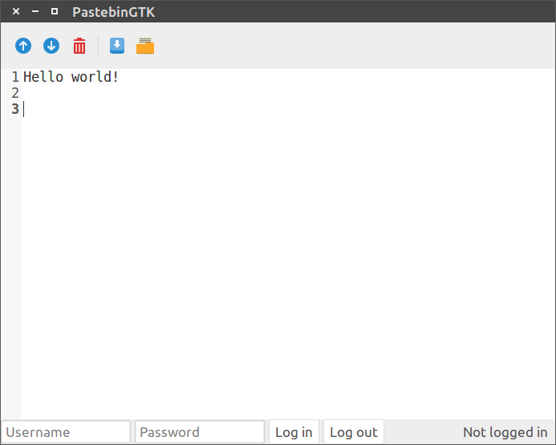

# About PastebinGTK

PastebinGTK is a desktop client for the [pastebin.com](http://pastebin.com/) text sharing service.

Among other features, it is able to create,
read, and delete pastes, as well as list recent pastes and pastes created by a user.

# Using PastebinGTK

PastebinGTK requires the Python interpreter to run. Development is done using 2.7.x, but it should work with 3.x as well. GTK+ 3 and its
Python bindings are also required.

To run PastebinGTK, open a terminal in the directory containing the files and type `python pastebingtk.py`. On some systems double-clicking on the 
`pastebingtk.py` file will also work.

PastebinGTK currently only runs on Linux and Windows. Note that while the application should work on Windows, it is not extensively tested on that
platform.

# License

PastebinGTK is released under the [MIT open source license](http://opensource.org/licenses/mit-license.php). See the `LICENSE` file for more information.

PastebinGTK uses the [python-pastebin](https://github.com/achesak/python-pastebin) API wrapper to get data from pastebin.com

The program icon is from the Flat UI icon set by [Designmodo](http://designmodo.com), licensed under [Creative Commons Attribution 3.0 Unported (CC BY 3.0)](http://creativecommons.org/licenses/by/3.0/). 
